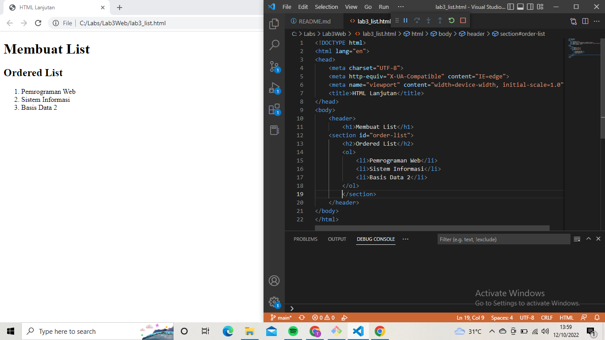
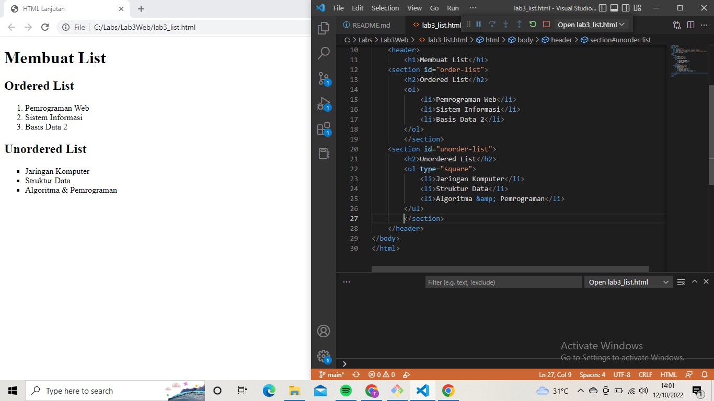
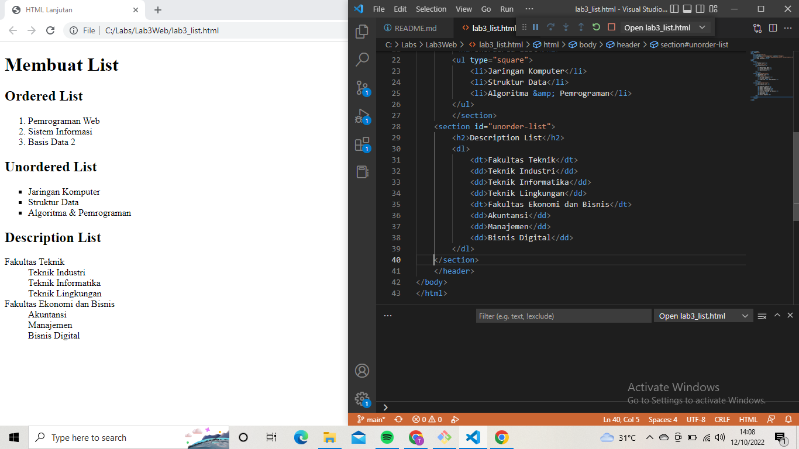
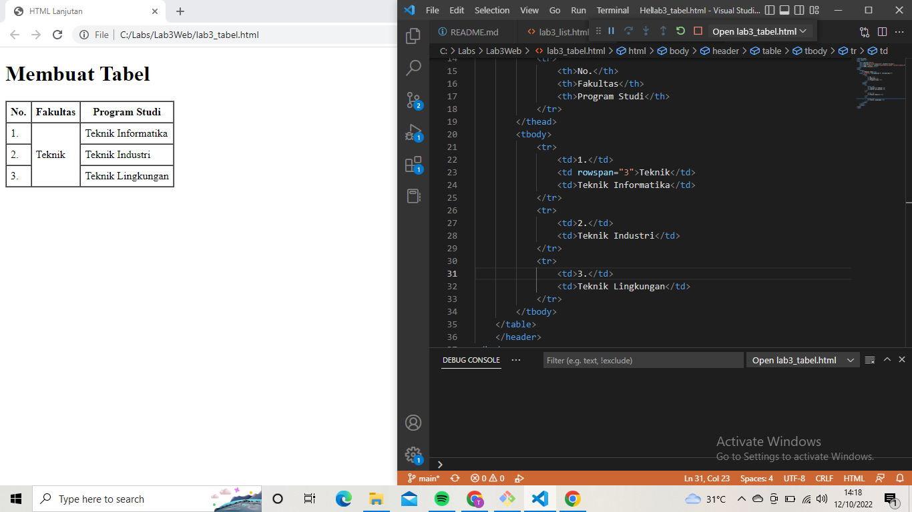
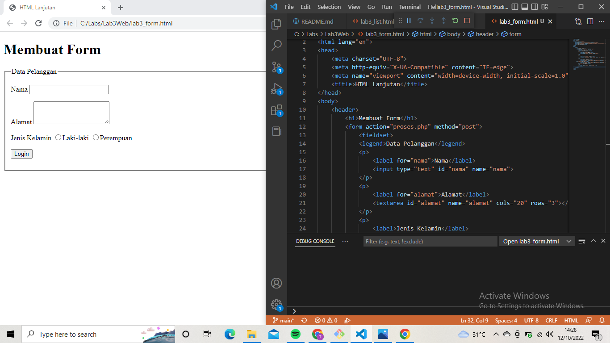
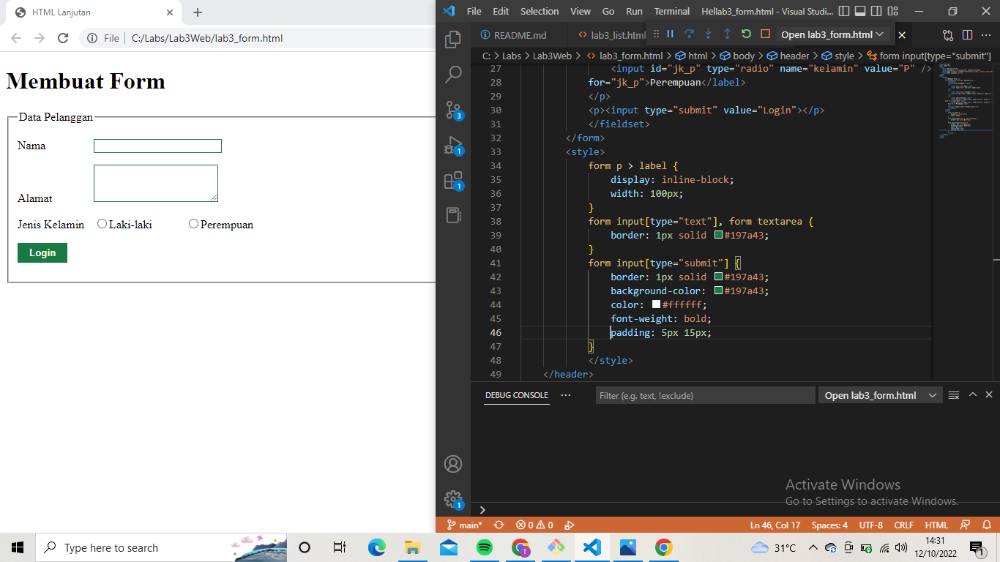
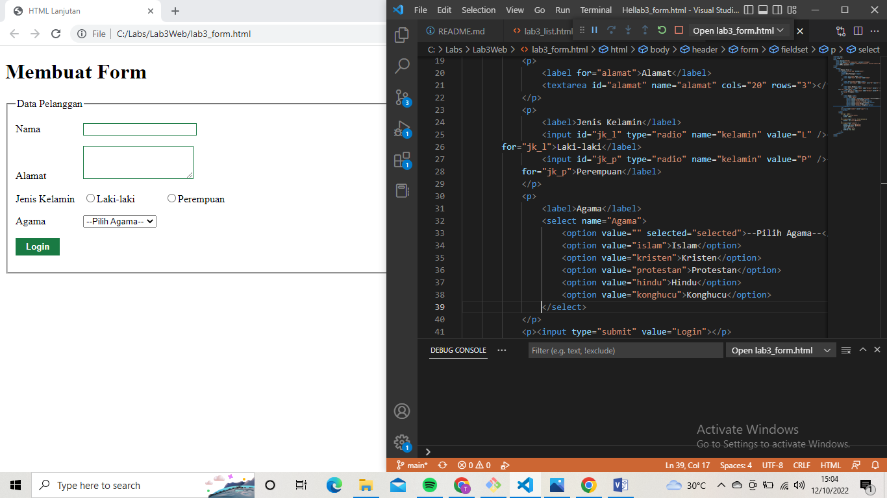
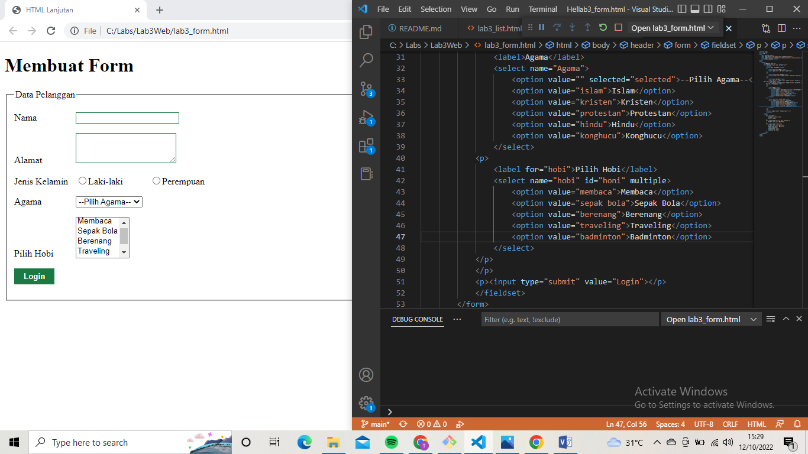

# Lab3Web
## Belajar HTML

### Membuat Ordered List

### Membuat Unoerdered List

### Membuat Description List

### Membuat Tabel

### Menghubungkan Sel Data Tabel

### Membuat Form

### Menambahkan Style pada Form

### Form Dropdown

### Form menus Listbox
